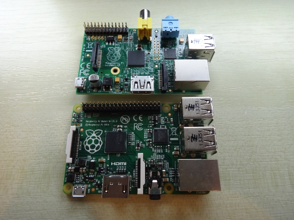

# A teacher's guide to using Raspberry Pi in the classroom

If you are looking to use Raspberry Pis in your classroom, then there are a number of ways you can do this outlined in this guide. Some solutions repurpose existing classroom kit in order to minimise further expense.

## Getting started with Raspberry Pi

It is recommended that you first read [this guide to learn how to set up a standalone Raspberry Pi](getting-started-guide.md) for the first time, if you are new to using the device, before reading on.

One way to use Raspberry Pi in the classsroom is as a standalone device that students can use outside of the school network to create programs and electronic projects, without fear of breaking expensive equipment or taking down an entire school network. It is an environment that allows for the freedom of failure, and it is through failing that students learn. If a file system becomes corrupted then it's okay, as you can always start again with a fresh SD card image. If you blow an LED, it doesn't matter. 

Another appealing feature of the Raspberry Pi in education is that it looks interesting, and students ask questions about the hardware. How is it a computer? How does it work? What are input and output devices? Where does it store its software? and so on. 

## Hardware required

### What you will need for a standalone class set of Raspberry Pis

- A number of Raspberry Pis; one between two can work depending on the work students are doing. Either [Model B](http://www.raspberrypi.org/product/model-b/) or [Model B+](http://www.raspberrypi.org/product/model-b-plus/).
- Enough [SD Cards or microSD Cards](http://swag.raspberrypi.org/collections/frontpage/products/noobs-8gb-sd-card) (Model B+) for each Pi. 
- USB keyboards and mice for each Pi.
- [Micro USB power supply](http://swag.raspberrypi.org/collections/pi-kits/products/raspberry-pi-universal-power-supply) for each Pi.
- HDMI cable to connect to a monitor for each Pi (see Monitor Solutions below).
- A monitor for each Pi.

### Further items you will need for a networked class set of Raspberry Pis

- Ethernet cable connection
- Or a WiFi dongle (like [this one](http://thepihut.com/products/usb-wifi-adapter-for-the-raspberry-pi) from [The Pi Hut](http://thepihut.com/))

### Optional extras

- [Pi Hubs](http://shop.pimoroni.com/products/pihub) can be used to power more than one Raspberry Pi and provides extra USB slots.
- An SD card duplicator to copy SD card images to multiple cards. These are handy for making a class set. Unfortunately, they cost £500 or more. 

## Monitor solutions

You could use existing school monitors with Raspberry Pis. You will need to check the cables to see if they have the correct connectors for the Pi. 

- **HDMI** The Raspberry Pi outputs through a HDMI connector to a TV or monitor. Most modern TVs, monitors, and projectors use HDMI. However this is not always the case in classrooms, where technology is a few years older.
  
  

- **DVI** If the monitors in your classroom do not have a HDMI connector, but have a DVI connector, then you can purchase HDMI to DVI cables. This is an additional cost, but these cables are relatively inexpensive and replace the need for HDMI cables. 
  
  

- **VGA** If you have equipment that is more than a few years old, then it is likely that the monitors will have VGA connectors. In this case you will need to get a VGA adaptor for the Raspberry Pi at an additional cost. It is recommended that before you make this choice you consider some of the solutions below for using the school network to connect to the Pis instead.
  
  

## Networked solutions

You or your network administrators may wish to integrate Raspberry Pis more permanently into the school network. This is often a way to use existing hardware to connect to a Raspberry Pi, negating the need for extra monitors. Below are a number of ways of connecting to a Raspberry Pi using remote desktop software such as VNC, and a guide to using a Raspberry Pi terminal server as a solution to shared folders and SD card problems.

### Remote Desktop from classroom computers to Raspberry Pis

- [Using VNC to connect to a Raspberry Pi from a desktop computer](vnc-classroom-guide.md)
- [Using VNC through a browser window](vnc-browser-guide.md)

### Raspberry Pi Terminal Server 

- [Raspberry Pi Linux Terminal Server Project](http://gbaman.github.io/RaspberryPi-LTSP/)

## Cross-curricular opportunities

Using Raspberry Pis in a classroom can also offer different ways of teaching and learning. It opens up the possibility of seeing computing more as a creative and maker-style activity. Computing can be a truly cross-curricular subject in Art, Science and Technology. Raspberry Pi can offer more than you realise in education.

- [What does a good computing classroom look like? By Clive Beale](http://www.raspberrypi.org/what-does-a-good-computing-classroom-look-like)

## Teaching resources

With qualified teachers among our staff we are producing teaching materials, including full schemes of work that are cross-curricular, engaging, and satisfy the curriculum. They are published under a Creative Commons licence so that teachers can use them however they see fit.

- [Teach - Raspberry Pi Teaching Resources](http://www.raspberrypi.org/resources/teach/)
- A great place to start is with our [Getting Started Lesson](http://www.raspberrypi.org/learning/getting-started-with-raspberry-pi-lesson/)

## Training

Here at the Raspberry Pi Foundation we offer FREE CPD for teachers as the Raspberry Pi Academy or Picademy for short. To find out more click on the links below:

- [Picademy Page](http://www.raspberrypi.org/picademy)
- [Picademy 3. A report of some note by Clive Beale](http://www.raspberrypi.org/picademy-3-report/)

## Asking the community

The Raspberry Pi Community is ready, willing and in most cases able to help schools teach Computing with Raspberry Pis. They are an often untapped source of experience and resources. If, after reading through this guide, you still cannot find solutions to your classroom problems, then it is recommended that you reach out to the community. 

> When I started to use Raspberry Pis in my classroom in late 2012, the monitors were all VGA. At that time there was not a converter cable guaranteed to work, so I put a message out on Twitter asking if any local businesses were getting rid of any DVI monitors. Within a couple of minutes I had a response, and that weekend I collected the monitors I needed for free. 

> The Raspberry Pi community is one of the most helpful I've ever been in contact with as a teacher. Using the [forums](http://www.raspberrypi.org/forums) or Twitter with the hashtag `#raspberrypi` or `#picademy` could be a way to find solutions for your classroom too. ~ Carrie Anne Philbin

### The community page

On our website we feature prominent people and organisations within our community who are doing great outreach work. It is a good starting point to learn more about Raspberry Pi.
- [Offical Community Page](http://www.raspberrypi.org/community/)

### The forum

If you have a question, whatever your level or experience, then you can ask it on our forum. We have an education section especially set up for this. It is an extremely friendly forum, where someone will answer your question very quickly and politely. A number of our Raspberry Pi Certified Educators are active on this forum, helping to answer questions and share good practice. 
- [Education Section of Forum](http://www.raspberrypi.org/forums/viewforum.php?f=17&sid=f9cb8df1edfa3781e9a7afa26aaa4e42)
