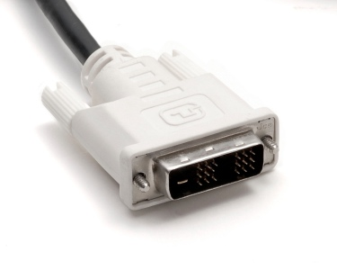
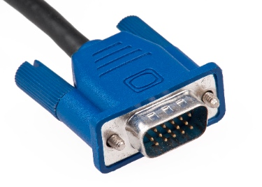

# A Teachers Guide to Using Raspberry Pi in the Classroom

If you are looking to use Raspberry Pis in your classroom then there are a number of ways in which you can do this outlined in this guide. Some solutions repurpose established classroom kit in order to minimise further expense.

## Getting Started with Raspberry Pi
It is recommended that you first read [this guide to learn how to setup a stand alone Raspberry Pi](getting-started-guide.md) for the first time, if you are new to using the device, before reading on.

## Hardware Required

### What you will need for a stand alone class set of Raspberry Pis
- A number of Raspberry Pis (one between two can work depending on the work students are doing) Either [Model B](http://www.raspberrypi.org/product/model-b/) or [Model B+](http://www.raspberrypi.org/product/model-b-plus/)
- Enough [SD Cards or Micro SD Cards](http://swag.raspberrypi.org/collections/frontpage/products/noobs-8gb-sd-card) (Model B+) for each Pi for Student. 
- USB keyboards and mice for each Pi
- [Micro USB power supply](http://swag.raspberrypi.org/collections/pi-kits/products/raspberry-pi-universal-power-supply) for each Pi
- HDMI cable to connect to a monitor for each Pi (see Monitor Solutions below)
- A monitor for each Pi

### What more you will need for a networked class set of Raspberry Pis
- Ethernet cable connection
- Or a Wifi Dongle (like [this one](http://thepihut.com/products/usb-wifi-adapter-for-the-raspberry-pi) from [The Pi Hut](http://thepihut.com/))

### Optional Extras
- [Pi Hubs](http://shop.pimoroni.com/products/pihub) can be used to power more than one Raspberry Pi and provides extra USB slots.
- An SD card duplicator to copy SD card images to multiple cards. Handy for a class set. Unfortunately they cost £500 upwards. 

## Monitor Solutions
You could use existing school monitors with Raspberry Pis. You will need to check what cable connectors they have on them in order to get the right cables to fit both the Pi and the monitor. 

- **HDMI** The Raspberry Pi outputs through a HDMI connector to a TV or Monitor. Most modern TVs, Monitors, and Projectors use HDMI. However this is not always the case in classrooms where technology is a few years older.
  
- **DVI** If the monitors in your classroom do not have a HDMI connector but do have a DVI connector then you can purchase HDMI to DVI cables. This is an additional cost but these cables are relatively inexpensive and replace the need for HDMI cables. 
  
- **VGA** If you have equipment that is more than a few years old, then it is likely that the monitors will have VGA connectors on them. In this case you will need to get a VGA adapter for the Raspberry Pi. This is an additional cost. It is recommended that before you make this choice that you look at some of the solutions below for using the school network to connect to the Pis instead.
  

## Networked Solutions

### Remote Desktop from Classroom Computers to Raspberry Pis
- [Using VNC to connect to a Raspberry Pi from a desktop computer](vnc-classroom-guide.md)
- [Using VNC through a browser window](vnc-browser-guide.md)

### Raspberry Pi Terminal Server 
- [Raspberry Pi Linux Terminal Server Project](http://gbaman.github.io/RaspberryPi-LTSP/)

## Classroom Furniture and Layout
- [What does a good computing classroom look like? By Clive Beale](http://www.raspberrypi.org/blog/#what-does-a-good-computing-classroom-look-like)

## Teaching Resources
With qualified teachers on staff we are producing teaching materials including full schemes of work that are cross curricular, engaging, and satisfy the curriculum. They are published under a Creative Commons licence so that teachers can use them however they see fit.

- [Teach - Raspberry Pi Teaching Resources](http://www.raspberrypi.org/resources/teach/)

## Training
Here at the Raspberry Pi Foundation we offer FREE CPD for teachers as the Raspberry Pi Academy or Picademy for short. To find out more click on the links below:

- [Picademy Page](http://www.raspberrypi.org/picademy)
- [Picademy 3. A report of some note by Clive Beale](http://www.raspberrypi.org/picademy-3-report/)

## Asking the Community
The Raspberry Pi Community is ready, willing and in most cases able to help schools teach Computing with Raspberry Pis. They are an often untapped resource of experience and resources. If, after reading through this guide, you still can not find solutions to your classroom problems then it is recommended that you reach out to the community. 

> When I started to use Raspberry Pis in my classroom in late 2012, the monitors were all VGA. At that time there was not a converter cable garanteed to work, so I put a message out on twitter asking if any local businesses were getting rid of any DVI monitors. Within a couple of minutes I had a response, and that weekend I collected the monitors I needed for free. 

> The Raspberry Pi community is one of the most helpful I've ever been in contact with as a teacher. Using the [forums](http://www.raspberrypi.org/forums) or Twitter with the hashtag `#raspberrypi` or `#picademy` could be a way to find solutions for your classroom too. ~Carrie Anne Philbin
